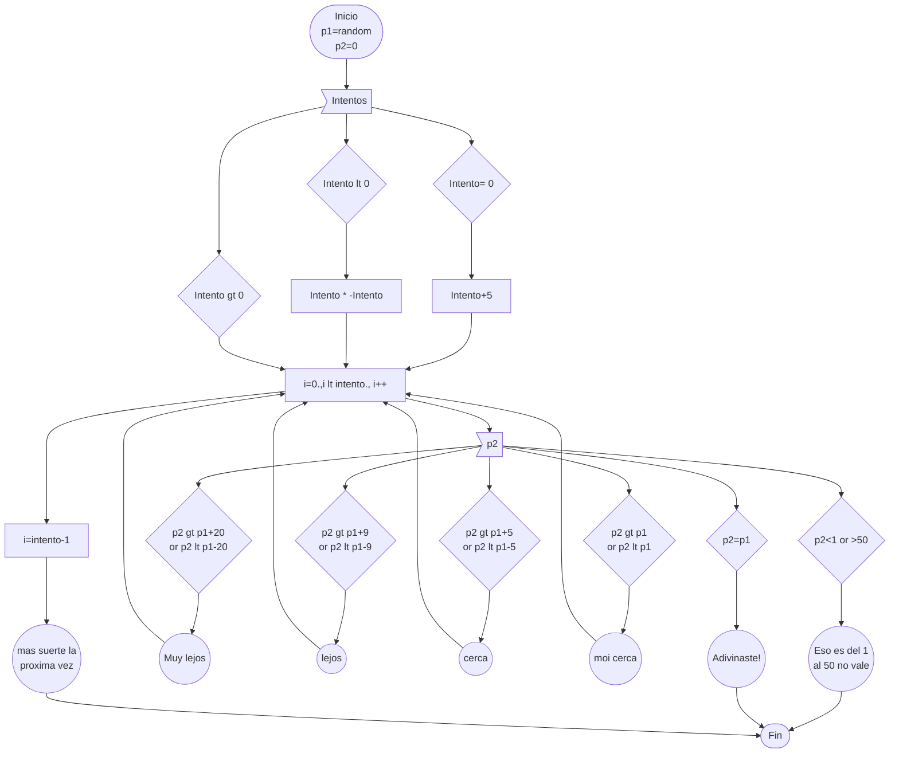

```mermaid
graph TD;
A([Inicio<br/>p1=random<br/>p2=0])-->B>Intentos];
B-->C{Intento= 0};
C-->D[Intento+5];
B-->E{Intento lt 0};
E-->F[Intento * -Intento];
B-->G{Intento gt 0};
H[i=0.,i lt intento., i++];
D-->H;
F-->H;
G-->H;
H-->I>p2];
I-->J{p2<1 or >50};
J-->K((Eso es del 1 <br/> al 50 no vale));
K-->f([Fin]);
I-->L{p2 gt p1+20 <br/> or p2 lt p1-20};
L-->l((Muy lejos));
l-->H;
I-->M{p2 gt p1+9 <br/> or p2 lt p1-9};
M-->m((lejos));
m-->H;
I-->N{p2 gt p1+5 <br/> or p2 lt p1-5};
N-->n((cerca));
n-->H;
I-->O{p2 gt p1 <br/> or p2 lt p1};
O-->dif((moi cerca));
dif-->H;
I-->P{p2=p1}
P-->p((Adivinaste!));
p-->f;
H-->Q[i=intento-1];
Q-->q((mas suerte la <br/> proxima vez));
q-->f;
```